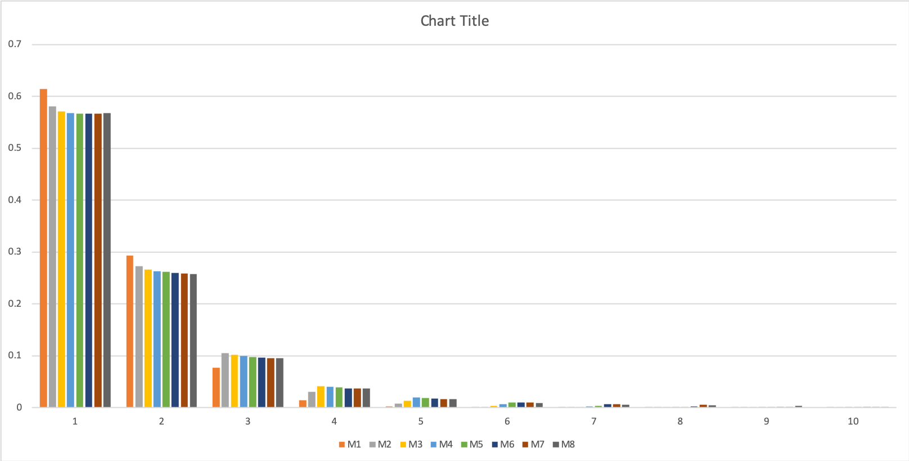
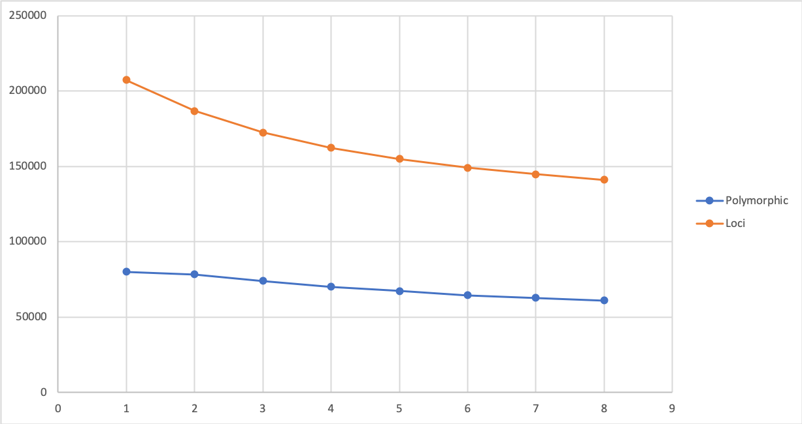

July 30\. 2019

None have low enough reads to discard. Fairly tight distribution.

Need to pick a subset for testing so I will use a dozen

Brook\_RA0754 Brook

Halfm\_RA1214 Halfm

Chris\_OR0222 Chris

OaksB\_RA0701 OaksB

Stell\_RA1617 Stell

AmysA\_RA1404 AmysA

Abbey\_RA1204 Abbey

Stell\_RA1620 Stell

VetCr\_RA0655 VetCr

Heron\_RA1477 Heron

Powel\_RA0735 Powel

Hylan\_RA1278 Hylan

Aug 1 results

Used M4 n4

